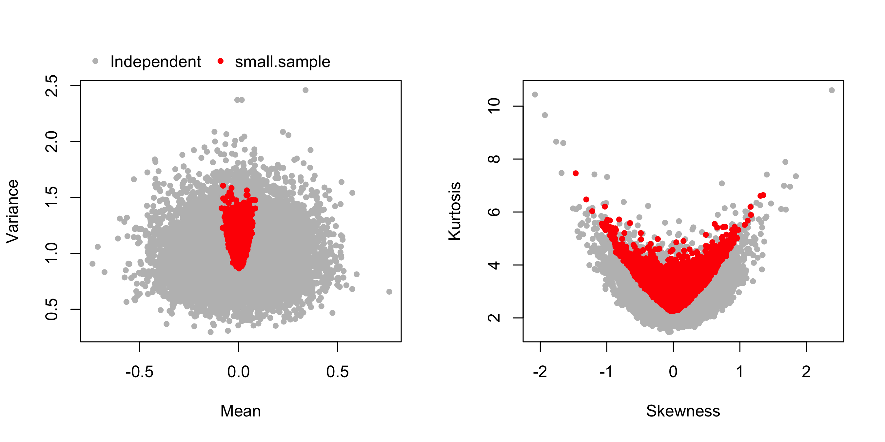

# small.sample
This R package is able to generate a small sample of representative points
that retain the characteristics of a chosen distribution.


# Installing via Github
One can install the package directly from this repository:
```r
install.packages("devtools")
devtools::install_github("iris-yi-jiang/small.sample")
```
The first line above is not needed if you have `devtools` installed.
